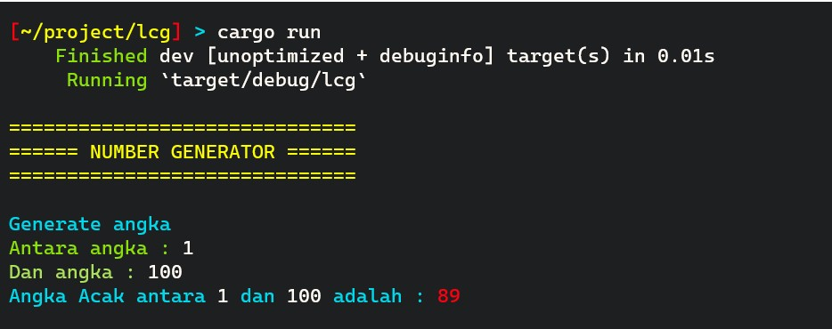

# Menyimulasikan Randomness dalam Komputer
**Random Number** atau Nomor Acak sudah sering kita gunakan dalam pemrograman. 
Ada 2 metode untuk mendapatkan random number yaitu **True Random Numbers** dan **Pseudorandom Numbers**

**True Random Numbers**,
Metode ini dengan cara melakukan pengukuran terhadap segala sesuatu yang dipastikan random, seperti **Radioactive Decay**.
Nomor yang didapat dari cara ini dapat dikatakan sebagai **True** random numbers. 
Tentu saja hal ini sangat susah untuk disimulasikan karena mahal dan tidak praktis.

**Pseudorandom Numbers**,
Metode alternatif untuk mendapatkan angka acak. Metode ini melibatkan perhitungan *algoritama* yang **tampaknya** dapat 
menghasilkan hasil yang random. Pada akhirnya hasil yang didapat itu ditentukan oleh *initial value* atau yang biasanya disebut
nilai **Seed**. Metode ini jauh lebih mudah untuk dipraktikan, jadi simulasi ini akan menggunakan metode ini.


## Algoritma
Algoritma yang digunakan dalam simulasi ini adalah LCG, LCG adalah :

> Linear Congruential Generator ( LCG ) adalah algoritma yang menghasilkan urutan angka pseudo-acak 
yang dihitung dengan persamaan linear sepotong -sepotong yang terputus-putus. 
Metode ini merupakan salah satu algoritma pembangkit bilangan pseudorandom tertua dan paling terkenal. 
Teori di baliknya relatif mudah dipahami, dan mudah diimplementasikan dan cepat, 
terutama pada perangkat keras komputer yang dapat menyediakan aritmatika modular dengan pemotongan bit penyimpanan.
>
> -- Wikipedia: Linear congruential generator

### Rumus LCG
Rumus dasarnya adalah :

***X<sub>n-1</sub> = ( aX<sub>n</sub> + c ) mod m***

keterangan :
- m = modulus; m > 0
- a = multiplier; 0 < a < m
- c = Increment; 0 < c < m
- X<sub>n</sub> = Nilai input pada siklus ke - n
  - X<sub>0</sub> = Intial Value atau Start Value
- X<sub>n+1</sub> = Hasil pada siklus tersebut 


## Pengaplikasian pada Kode
Bahasa pemrograman yang digunakan adalah **rust**

### Translate rumus menjadi kode
```rust
let mut xa = ((a * x0) + c ) % m
```
**Penyesuaian nama variable**; xa = X<sub>n+1</sub> dan x0 = X<sub>n</sub>

### Siklus
Perhitungan akan dilakukan hingga 4 kali siklus (X<sub>4</sub>)

### Parameter
Nilai variable yang digunakan :
- m = 2<sup>32</sup> = 4294967296
- a = 1664525
- c = 1013904223

### Starting Value / Seed (X<sub>0</sub>)
Nilai seed akan ditentukan oleh **waktu**. Sehingga nilainya akan berubah - ubah tergantung waktu kode dijalankan.
Rumus menentukan Seed adalah :

**X<sub>0</sub> = jam * menit * detik + tanggal * bulan * tahun**


### User Input
Pengguna dapat menentukan rentang antara berapa nomor acak tersebut terletak (Contoh : nomor acak antara 1 - 10). 
Rumus yang digunakan :

**Result = offset + (X<sub>n+1</sub> mod range)**

Keterangan :
- Result = Hasil angka acak yang diperoleh sesuai rentang yang diberikan user
- Offset = Angka yang paling kecil yang user masukkan sebagai titik awal rentang
- Range = Angka terbesar yang user masukkan dikurang Angka terkecil yang user masukkan
- X<sub>n+1</sub> = Hasil dari LCG


## Menjalankan Program
Untuk menjalankan program, pertama clone repository ini, lalu install [Cargo](https://doc.rust-lang.org/cargo/getting-started/installation.html). 
dan setelah itu jalankan kode berikut : 

```bash
cargo run
```


## Lampiran




## Referensi
- Arobelidze, Alexander. 2020. ["Random Number Generator: How Do Computers Generate Random Numbers?"](https://www.freecodecamp.org/news/random-number-generator/)"
- Wikipedia. 2020. ["Linear congruential generator"](https://en.wikipedia.org/wiki/Linear_congruential_generator)
- Gangwar, Meghna. 2022. ["How to Create a Random Number Generator in C++"](https://www.digitalocean.com/community/tutorials/random-number-generator-c-plus-plus) 
